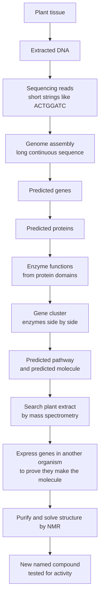

# From DNA Letters to a New Molecule: A Tutorial on Biosynthetic Gene Clusters

This tutorial follows one imaginary plant, **Plant A**, from a tube of extracted DNA to the discovery of a compound nobody has described before. At every step it shows what the data look like, how they are transformed into the next form, and why the step matters.

> **Note on the example.** Plant A, its genes, and the final compound ("tutorialin A") are invented for teaching. The sequences, codons, masses, and methods are real biology and real chemistry, so every transformation shown here can be checked by hand. Real published plant clusters are listed in [Section 18](#18-real-plant-clusters-that-were-found-this-way).

---


## Contents

1. [The big picture](#1-the-big-picture)
2. [Core vocabulary](#2-core-vocabulary)
3. [Step 1 — Collect the plant and extract DNA](#3-step-1--collect-the-plant-and-extract-dna)
4. [Step 2 — Sequencing: DNA becomes reads](#4-step-2--sequencing-dna-becomes-reads)
5. [Step 3 — Assembly: reads become a genome](#5-step-3--assembly-reads-become-a-genome)
6. [Step 4 — Gene prediction: finding genes in the genome](#6-step-4--gene-prediction-finding-genes-in-the-genome)
7. [Step 5 — Transcription and translation: gene becomes protein](#7-step-5--transcription-and-translation-gene-becomes-protein)
8. [Step 6 — Functional annotation: what does the protein do?](#8-step-6--functional-annotation-what-does-the-protein-do)
9. [Step 7 — Cluster detection: genes that sit together](#9-step-7--cluster-detection-genes-that-sit-together)
10. [Step 8 — Co-expression: genes that switch on together](#10-step-8--co-expression-genes-that-switch-on-together)
11. [Step 9 — Comparative genomics: Plant A versus its relatives](#11-step-9--comparative-genomics-plant-a-versus-its-relatives)
12. [Step 10 — Predicting the chemistry](#12-step-10--predicting-the-chemistry)
13. [Step 11 — Metabolomics: is the molecule really in the plant?](#13-step-11--metabolomics-is-the-molecule-really-in-the-plant)
14. [Step 12 — Proving the genes make the molecule](#14-step-12--proving-the-genes-make-the-molecule)
15. [Step 13 — Solving the structure and naming the compound](#15-step-13--solving-the-structure-and-naming-the-compound)
16. [Step 14 — Testing what the compound does](#16-step-14--testing-what-the-compound-does)
17. [Why this matters](#17-why-this-matters)
18. [Real plant clusters that were found this way](#18-real-plant-clusters-that-were-found-this-way)
19. [Full glossary](#19-full-glossary)

---


## 1. The big picture

Plants make thousands of small molecules that are not needed for basic growth. These are called **specialized metabolites** (older term: *secondary metabolites*). They defend the plant against insects and microbes, attract pollinators, and protect against sun and drought. Many human medicines come from them: paclitaxel (yew), morphine (poppy), artemisinin (sweet wormwood), vinblastine (Madagascar periwinkle).

Each specialized metabolite is built by a short assembly line of **enzymes**. Each enzyme is a protein, and each protein is encoded by a **gene**. In some plants, the genes for one assembly line sit next to each other on the same chromosome. That group of neighboring genes is a **biosynthetic gene cluster (BGC)**.

Finding the cluster in the DNA tells you which enzymes exist, which predicts what chemistry they can perform, which predicts what molecule the plant makes. That chain is the whole idea of this tutorial:




Steps A–I are computational predictions from DNA. Steps J–M are laboratory experiments that test those predictions. **A gene sequence alone never proves a compound exists.** The prediction becomes a discovery only when chemistry confirms it.

---


## 2. Core vocabulary

These terms are used in every step that follows.


| Term                 | Meaning                                                                                                                                       | Why it matters here                                                                            |
| -------------------- | --------------------------------------------------------------------------------------------------------------------------------------------- | ---------------------------------------------------------------------------------------------- |
| **DNA**              | Deoxyribonucleic acid. A long chain of four building blocks (**bases**): **A** (adenine), **C** (cytosine), **G** (guanine), **T** (thymine). | The instructions for every enzyme are written in this four-letter alphabet.                    |
| **Base pair (bp)**   | Two bases held together across the two DNA strands. A always pairs with T; C always pairs with G.                                             | Genome sizes are measured in bp. 1 kb = 1,000 bp; 1 Mb = 1,000,000 bp.                         |
| **Strand**           | DNA is double-stranded. The two strands run in opposite directions, labeled 5′ and 3′.                                                        | A gene can be on either strand, so software reads both.                                        |
| **Genome**           | All the DNA in one organism. Plant genomes range from about 100 Mb to over 100,000 Mb.                                                        | This is what the project sequences for each plant.                                             |
| **Chromosome**       | One very long DNA molecule inside the nucleus.                                                                                                | Clusters are located on chromosomes; neighbors on the same chromosome are what make a cluster. |
| **Gene**             | A stretch of DNA that is copied into RNA and usually translated into a protein.                                                               | One enzyme = one gene (usually).                                                               |
| **RNA / mRNA**       | Ribonucleic acid. Same idea as DNA but uses **U** (uracil) instead of T. Messenger RNA (mRNA) is the working copy of a gene.                  | Measuring mRNA tells you which genes are switched on.                                          |
| **Codon**            | Three bases of mRNA that specify one amino acid.                                                                                              | The code that converts DNA letters into protein.                                               |
| **Amino acid**       | One of 20 building blocks of proteins, written as one-letter codes (M, A, L, D …).                                                            | The protein sequence determines what the enzyme does.                                          |
| **Protein / enzyme** | A chain of amino acids that folds into a shape. An enzyme is a protein that performs a chemical reaction.                                     | Enzymes are the machines that build the metabolite.                                            |
| **Metabolite**       | A small molecule made by a living cell.                                                                                                       | The final target of the discovery.                                                             |
| **Pathway**          | The ordered series of enzyme reactions that turns a starting molecule into a final product.                                                   | A cluster usually encodes one pathway.                                                         |


---


## 3. Step 1 — Collect the plant and extract DNA


### What you do

1. **Collect and identify the plant.** A botanist confirms the species and deposits a dried **voucher specimen** in a herbarium. Without a voucher, nobody can later check that the DNA really came from Plant A.
2. **Freeze young leaf tissue** in liquid nitrogen. Young leaves have more cells per gram and fewer chemicals that damage DNA.
3. **Grind and extract.** A common plant method is the **CTAB method**. CTAB is a detergent that breaks open cells and separates DNA from the sugars and polyphenols that plants are full of.
4. **Check quality.** For modern long-read sequencing you need **high-molecular-weight (HMW) DNA**, meaning long unbroken molecules (tens of thousands of bp or more).


### What the data look like

At this stage there is no sequence yet. You have a clear liquid in a tube, and quality numbers:


| Measurement     | Example value for Plant A | What it tells you                                                                       |
| --------------- | ------------------------- | --------------------------------------------------------------------------------------- |
| Concentration   | 120 ng/µL                 | Enough DNA for sequencing.                                                              |
| A260/A280 ratio | 1.85                      | Little protein contamination (about 1.8 is ideal). This is a UV absorbance measurement. |
| A260/A230 ratio | 2.05                      | Little contamination from sugars, polyphenols, or salt.                                 |
| Fragment length | Most molecules > 40 kb    | Long enough for long-read sequencing.                                                   |


### Significance

Every later step depends on this one. Plant DNA is hard to extract cleanly, and broken or contaminated DNA gives a fragmented genome. A fragmented genome can split a cluster across several pieces, so the cluster is never recognized.

---


## 4. Step 2 — Sequencing: DNA becomes reads


### What happens

A sequencing machine cannot read a whole chromosome from end to end. It reads many short or medium pieces of DNA, called **reads**, and reports each one as a string of letters.


| Technology                   | Typical read length       | Strength                                                                                             |
| ---------------------------- | ------------------------- | ---------------------------------------------------------------------------------------------------- |
| Illumina (short reads)       | 150 bp                    | Very accurate, cheap per base.                                                                       |
| PacBio HiFi (long reads)     | 15,000–25,000 bp          | Long *and* accurate. The current standard for new plant genomes.                                     |
| Oxford Nanopore (long reads) | 10,000 to over 100,000 bp | Longest reads; spans difficult repeats.                                                              |
| Hi-C (proximity data)        | Pairs of short reads      | Shows which pieces of DNA are near each other in the nucleus; used to order pieces into chromosomes. |


### The first transformation: molecule → text

For this tutorial, imagine a tiny region of Plant A’s genome. The machine produces three overlapping reads from it. The second one contains the string you might see quoted in a lab meeting: `ACTGGATC`.

```text
Read 1:  GCTATAAAGGCCATGGCA
Read 2:              ATGGCACTGGATCAAGGTTT
Read 3:                           AAGGTTTCGAATGGTAAGCATT
```

`ACTGGATC` is in Read 2, starting at its sixth letter:

```text
Read 2:  ATGGC ACTGGATC AAGGTTT
               ^^^^^^^^
```


### The file format: FASTQ

Reads are saved in a **FASTQ** file. Each read takes four lines: a name, the sequence, a separator, and a **quality score** for each letter.

```text
@PlantA_read_2
ATGGCACTGGATCAAGGTTT
+
IIIIIIIIIIIIIIIHHHGF
```

Each quality character encodes a **Phred score**. `I` means a score of 40, which is a 1-in-10,000 chance that letter is wrong. Lower letters near the end of a read are normal; accuracy drops as the machine keeps reading.

### Significance

A real plant genome project produces billions of bases of reads. For a 1,000 Mb genome, sequencing to **30× coverage** means each position in the genome is read about 30 times on average. Coverage is what lets software out-vote occasional errors.

---


## 5. Step 3 — Assembly: reads become a genome


### What happens

**Assembly** is putting the reads back together by finding where they overlap, like reconstructing a shredded page from many copies.

### The second transformation: reads → contig

Read 1 ends with `ATGGCA`. Read 2 starts with `ATGGCA`. Read 2 ends with `AAGGTTT`. Read 3 starts with `AAGGTTT`. Line them up on those overlaps:

```text
Read 1:  GCTATAAAGGCCATGGCA
Read 2:              ATGGCACTGGATCAAGGTTT
Read 3:                           AAGGTTTCGAATGGTAAGCATT
         ----------------------------------------------
Contig:  GCTATAAAGGCCATGGCACTGGATCAAGGTTTCGAATGGTAAGCATT
```

That merged sequence (47 bp here) is a **contig**: a continuous stretch of reconstructed genome. In a real project, contigs are millions of bp long.

### Building up to chromosomes


| Unit                          | What it is                                                                                               |
| ----------------------------- | -------------------------------------------------------------------------------------------------------- |
| **Read**                      | One piece straight from the machine.                                                                     |
| **Contig**                    | Reads merged on overlaps; no gaps.                                                                       |
| **Scaffold**                  | Contigs placed in order with small gaps of unknown sequence between them (often ordered with Hi-C data). |
| **Chromosome-level assembly** | Scaffolds that each represent one full chromosome.                                                       |


### How you know the assembly is good


| Metric                 | Meaning                                                                                             | Example value for Plant A |
| ---------------------- | --------------------------------------------------------------------------------------------------- | ------------------------- |
| Total length           | Should match the expected genome size.                                                              | 1,210 Mb                  |
| **Contig N50**         | Half the genome is in contigs at least this long. Higher is better.                                 | 18.4 Mb                   |
| **BUSCO completeness** | Percent of a standard set of genes that every land plant should have, found intact in the assembly. | 98.1%                     |


### Significance

A cluster for one pathway can span 30–300 kb. If the contig N50 is only 50 kb, the cluster is likely broken across several contigs, and software will see a few unrelated-looking genes instead of one cluster. **Long contigs are what make cluster discovery possible.**

---


## 6. Step 4 — Gene prediction: finding genes in the genome


### What happens

The assembled genome is just letters. **Gene prediction** (also called **structural annotation**) marks where the genes are. Tools such as **BRAKER** or **AUGUSTUS** look for gene signals, and they are much more accurate when given RNA sequencing data from the same plant as evidence.

### Signals a gene-finder looks for


| Signal                       | What it is                                                                              | In our contig                          |
| ---------------------------- | --------------------------------------------------------------------------------------- | -------------------------------------- |
| **Promoter**                 | DNA upstream of a gene where the machinery that copies the gene binds.                  | Region before the gene.                |
| **TATA box**                 | A common promoter element, often `TATAAA`.                                              | `GCTATAAAGG…`                          |
| **Start codon**              | `ATG`. Translation begins here.                                                         | position 13                            |
| **Open reading frame (ORF)** | A run of codons from a start codon to a stop codon with no stop in between.             | positions 13–42                        |
| **Stop codon**               | `TAA`, `TAG`, or `TGA`. Translation ends here.                                          | `TAA` at positions 40–42               |
| **Exons and introns**        | Exons are kept in the mRNA. Introns are cut out. Most plant genes have several introns. | None in this toy gene, for simplicity. |


### The third transformation: contig → annotated gene

Mark the signals on the contig:

```text
Contig:  GCTATAAAGGCC ATG GCA CTG GAT CAA GGT TTC GAA TGG TAA GCATT
            ^^^^^^    ^^^                                 ^^^
            TATA box  start                               stop

         |-promoter-| |-------------- coding sequence (CDS) ----------| |-3' region-|
```

The gene-finder writes the result in a **GFF** file, a table that lists each gene’s location:

```text
contig_1  BRAKER  gene  13  42  .  +  .  ID=PaTPS1
contig_1  BRAKER  CDS   13  42  .  +  0  Parent=PaTPS1
```

The `+` means the gene is on the forward strand. The name `PaTPS1` is given later, once the function is known (Pa = Plant A, TPS = terpene synthase).

### About the other strand

A gene could equally sit on the opposite strand. Software reads the **reverse complement**: swap each base for its pair (A↔T, C↔G) and reverse the order.

```text
Forward:              ACTGGATC
Complement:           TGACCTAG
Reverse complement:   GATCCAGT
```


### About introns (in a real gene)

In a real Plant A gene, an intron might interrupt the coding sequence. Introns almost always start with `GT` and end with `AG`. They are copied into the first RNA copy and then cut out (**splicing**):

```text
DNA:        ATGGCACTG GTAAGTATTTTGCAG GATCAAGG...
            [exon 1 ] [   intron    ] [exon 2...]
                      GT...........AG

mRNA after splicing:  AUGGCACUG GAUCAAGG...
```


### Significance

A real plant genome has 25,000–50,000 genes. Gene prediction turns 1,210 Mb of letters into a list of genes with coordinates. Every downstream step works from that list.

---


## 7. Step 5 — Transcription and translation: gene becomes protein

This step happens inside the plant cell. Computationally, software repeats it to predict each protein’s sequence.

### The fourth transformation: DNA → mRNA (transcription)

**Transcription** copies the gene into mRNA. The mRNA reads the same as the coding DNA, except **T becomes U**.

```text
DNA (coding):  ATG GCA CTG GAT CAA GGT TTC GAA TGG TAA
mRNA:          AUG GCA CUG GAU CAA GGU UUC GAA UGG UAA
```


### The fifth transformation: mRNA → protein (translation)

**Translation** happens on the **ribosome**. It reads the mRNA three letters at a time. Each codon specifies one amino acid using the **genetic code**:


| Codon | Amino acid         | One-letter code |
| ----- | ------------------ | --------------- |
| AUG   | Methionine (start) | M               |
| GCA   | Alanine            | A               |
| CUG   | Leucine            | L               |
| GAU   | Aspartate          | D               |
| CAA   | Glutamine          | Q               |
| GGU   | Glycine            | G               |
| UUC   | Phenylalanine      | F               |
| GAA   | Glutamate          | E               |
| UGG   | Tryptophan         | W               |
| UAA   | Stop               | —               |


Apply it codon by codon:

```text
mRNA:     AUG GCA CUG GAU CAA GGU UUC GAA UGG UAA
Protein:   M   A   L   D   Q   G   F   E   W  (stop)
```

The toy protein is `MALDQGFEW`. Proteins are saved as text in **FASTA** format:

```text
>PaTPS1_fragment
MALDQGFEW
```


### Back to the real gene

The real `PaTPS1` gene is about 1,700 bp of coding sequence and encodes a protein of about 570 amino acids. Our 9-amino-acid piece is only its very beginning. From here on, think of the full protein:

```text
>PaTPS1 (Plant A terpene synthase 1, 570 aa, shown in part)
MALDQGFEW ... (about 290 aa) ... RLIDDIYDAYGTLEEL ... (about 260 aa)
```


### Significance

The protein sequence is what you can compare against everything already known about enzymes. DNA sequences change quickly between species because several codons can encode the same amino acid. Protein sequences change more slowly, so related enzymes are easier to recognize at the protein level.

---


## 8. Step 6 — Functional annotation: what does the protein do?


### What happens

**Functional annotation** gives each predicted protein a likely job. There are two main methods.


| Method                | Tool examples                     | What it does                                                                                                                                          |
| --------------------- | --------------------------------- | ----------------------------------------------------------------------------------------------------------------------------------------------------- |
| **Similarity search** | BLAST, DIAMOND                    | Finds the most similar known proteins in databases. If PaTPS1 is 62% identical to a known diterpene synthase, it is probably also a terpene synthase. |
| **Domain search**     | InterProScan, HMMER with **Pfam** | Finds **domains**: conserved regions that fold into a recognizable shape with a known job.                                                            |


### Motifs: tiny signatures of function

A **motif** is a short, highly conserved pattern of amino acids at the working part (**active site**) of an enzyme. Terpene synthases have the famous **DDxxD motif** (x means any amino acid). Those aspartates (D) grip magnesium ions, which hold the starting molecule in place for the reaction.

In PaTPS1:

```text
...R L I D D I Y D A Y G T L E E L...
         D D x x D
         ^ ^     ^
```

`DDIYD` matches DDxxD. That strongly supports PaTPS1 being a terpene synthase.

### Common enzyme families in plant clusters


| Family                  | Abbreviation | Reaction                                    | Chemical meaning                                                 |
| ----------------------- | ------------ | ------------------------------------------- | ---------------------------------------------------------------- |
| Terpene synthase        | TPS          | Folds a linear chain into rings             | Creates the **carbon skeleton**: the core shape of the molecule. |
| Oxidosqualene cyclase   | OSC          | Folds a 30-carbon chain into rings          | Skeleton enzyme for triterpenes and sterols.                     |
| Cytochrome P450         | CYP          | Adds an oxygen atom (often as –OH)          | **Decorates** the skeleton; changes solubility and activity.     |
| BAHD acyltransferase    | BAHD         | Attaches an acyl group (for example acetyl) | Further decoration; often affects potency.                       |
| UDP-glycosyltransferase | UGT          | Attaches a sugar                            | Makes the molecule water-soluble or stores it safely.            |
| Methyltransferase       | MT           | Attaches a methyl group (–CH3)              | Fine-tunes the molecule.                                         |
| ABC or MATE transporter | —            | Moves molecules across membranes            | Exports the product or stores it in the vacuole.                 |


### Annotation results for the Plant A region


| Gene     | Best similarity hit                | Domains found                                                | Assigned function           |
| -------- | ---------------------------------- | ------------------------------------------------------------ | --------------------------- |
| PaTPS1   | Diterpene synthase (62% identical) | Terpene synthase N-terminal and metal-binding domains; DDxxD | Builds a diterpene skeleton |
| PaCYP71A | CYP71 family P450 (55%)            | P450 domain                                                  | Adds –OH                    |
| PaCYP76B | CYP76 family P450 (48%)            | P450 domain                                                  | Adds a second –OH           |
| PaBAHD1  | BAHD acetyltransferase (51%)       | Transferase domain                                           | Adds an acetyl group        |
| PaABC1   | ABC transporter (70%)              | ABC transporter domains                                      | Moves the product           |


### Significance

At this point you know which reactions Plant A’s enzymes can perform, but not what they produce together. Annotation says “this is a P450,” not “this P450 puts an OH on carbon 7 of a molecule nobody has seen.” The rest of the tutorial narrows that gap.

---


## 9. Step 7 — Cluster detection: genes that sit together


### What a gene cluster is

In most plants, the genes of one pathway are scattered across different chromosomes. In a **biosynthetic gene cluster**, they are physically next to each other. A typical plant cluster:

- has a **signature enzyme** that builds the skeleton (such as a TPS or OSb zdrueoifdjcxnC),
- has **tailoring enzymes** nearby that decorate it (P450s, acyltransferases, glycosyltransferases),
- spans tens to a few hundred kilobases,
- contains genes from **different** enzyme families (a block of five copies of the same gene is a tandem duplicate, not a pathway).

Why clusters exist in plants is still being studied. A leading explanation: if genes are inherited together, the plant rarely inherits a half-built pathway, which can produce toxic intermediates. Clusters also let the plant switch the whole pathway on and off together.

### The tool: plantiSMASH

**plantiSMASH** scans a plant genome plus its gene annotation. It looks for windows where a signature enzyme sits close to tailoring enzymes. (Its parent tool, **antiSMASH**, does the same for bacteria and fungi, where clusters are far more common.)

### The sixth transformation: annotated genes → cluster map

On chromosome 4 of Plant A, plantiSMASH reports this region:

```text
Chromosome 4 of Plant A   (gene start positions in kb)

  3,201      3,218      3,236       3,251       3,267      3,284      3,320
  [PaRPL7]---[PaTPS1]---[PaCYP71A]--[PaCYP76B]--[PaBAHD1]--[PaABC1]---[PaHSP90]
  ribosomal  SKELETON   tailoring   tailoring   tailoring  transport  heat-shock
  protein               (+OH)       (+OH)       (+acetyl)             protein

             |<------------ predicted cluster, about 85 kb ------->|
```

`PaRPL7` (a ribosomal protein, used by every cell) and `PaHSP90` (a general stress protein) are ordinary genes that happen to be neighbors. The candidate cluster is the five genes between them.

### Significance

Clustering is the shortcut that makes genome mining work. Without it, you would have to guess which of hundreds of P450s and acyltransferases scattered across the genome work with PaTPS1. With it, the candidates are already grouped.

**Caution:** physical closeness is evidence, not proof. Unrelated genes are sometimes neighbors by chance, and many real pathways are not clustered at all. That is why the next step is needed.

---


## 10. Step 8 — Co-expression: genes that switch on together


### What happens

Genes that work in the same pathway are usually switched on in the same tissue, at the same time. **RNA sequencing (RNA-seq)** measures how much mRNA each gene makes in each tissue. The unit is often **TPM** (transcripts per million): higher means the gene is more active.

### The seventh transformation: tissues → expression table


| Gene     | Root | Young leaf | Old leaf | Flower | Glandular trichome |
| -------- | ---- | ---------- | -------- | ------ | ------------------ |
| PaRPL7   | 410  | 455        | 390      | 430    | 420                |
| PaTPS1   | 2    | 38         | 4        | 6      | **1,240**          |
| PaCYP71A | 1    | 30         | 3        | 5      | **980**            |
| PaCYP76B | 3    | 41         | 2        | 8      | **1,105**          |
| PaBAHD1  | 1    | 27         | 5        | 4      | **870**            |
| PaABC1   | 4    | 35         | 6        | 9      | **760**            |
| PaHSP90  | 220  | 260        | 300      | 240    | 250                |


A **glandular trichome** is a tiny hair on the leaf surface that makes and stores defensive chemicals.

### Reading the table

- The five cluster genes are nearly silent in roots and very high in glandular trichomes. Their patterns match each other.
- PaRPL7 and PaHSP90 are steady everywhere. They are housekeeping genes, not pathway genes.
- The correlation between cluster genes across tissues is high (above 0.95 here). That supports a single coordinated pathway.


### Significance

Co-expression turns “genes that are near each other” into “genes that are near each other **and** work at the same place and time.” It also tells you where to look for the compound: **in glandular trichomes**, not roots. That saves months in the chemistry steps.

---


## 11. Step 9 — Comparative genomics: Plant A versus its relatives


### What happens

The project sequenced 33 species, so the cluster in Plant A can be compared with related plants. **Comparative genomics** asks: which species have this cluster, which have part of it, and does that match what the plants actually make?

**Synteny** means genes appearing in the same order on chromosomes of different species. Conserved synteny shows two regions descend from a common ancestral region.

### The eighth transformation: one genome → presence/absence across species


| Species                    | TPS | CYP71A | CYP76B | BAHD1 | ABC1 | Known chemistry                                 |
| -------------------------- | --- | ------ | ------ | ----- | ---- | ----------------------------------------------- |
| Plant A                    | ✓   | ✓      | ✓      | ✓     | ✓    | Uncharacterized trichome compounds              |
| Plant B (same genus)       | ✓   | ✓      | ✓      | ✗     | ✓    | A known diterpene **diol** (two –OH, no acetyl) |
| Plant C (same family)      | ✓   | ✓      | ✗      | ✗     | ✗    | A known diterpene with one –OH                  |
| Plant D (different family) | ✗   | ✗      | ✗      | ✗     | ✗    | No diterpenes of this type                      |


### What the pattern says

- Plant C has the skeleton enzyme plus one P450 and makes a one-OH diterpene. Plant B adds the second P450 and makes the two-OH version. That step-by-step match between genes and chemistry is strong evidence the cluster really builds this family of molecules.
- **Plant A is the only species with BAHD1.** It should be able to take Plant B’s known diol one step further and attach an acetyl group. If no such acetylated molecule has been reported, **Plant A may make a new compound.**


### How clusters gain new genes

Plant A probably got its extra step by **gene duplication** followed by **neofunctionalization**: a copy of an existing acyltransferase gene moved into, or arose next to, the cluster and evolved a new job. Comparing clusters across the 33 species can show when and how that happened.

### Significance

This is where sequencing many related species pays off. A single genome gives a prediction. Many genomes, matched to known chemistry, show which gene adds which piece, and point straight at the species most likely to hold something new.

---


## 12. Step 10 — Predicting the chemistry


### Starting material

Diterpenes are built from **GGPP** (geranylgeranyl diphosphate), a 20-carbon chain that every plant makes. A separate enzyme, GGPP synthase, supplies it; it does not need to be in the cluster.

P450 enzymes also need a partner, **cytochrome P450 reductase (CPR)**, to pass them electrons. That gene is elsewhere in the genome and is shared by many P450s.

### The ninth transformation: enzymes → predicted molecules

Each enzyme changes the molecule’s **formula** and therefore its **mass**. Mass spectrometry measures mass so precisely that these predictions become searchable targets.


| Step | Enzyme   | Change                                                | Predicted product                  | Formula    | Exact mass (Da) |
| ---- | -------- | ----------------------------------------------------- | ---------------------------------- | ---------- | --------------- |
| 0    | —        | Starting chain                                        | GGPP                               | C20H36O7P2 | —               |
| 1    | PaTPS1   | Folds chain into a ring skeleton; removes diphosphate | Diterpene hydrocarbon (compound 1) | C20H32     | 272.2504        |
| 2    | PaCYP71A | + O (one –OH)                                         | Diterpene alcohol (compound 2)     | C20H32O    | 288.2453        |
| 3    | PaCYP76B | + O (second –OH)                                      | Diterpene diol (compound 3)        | C20H32O2   | 304.2402        |
| 4    | PaBAHD1  | + acetyl (adds C2H2O)                                 | **Diol monoacetate (compound 4)**  | C22H34O3   | **346.2508**    |


How the masses are calculated, using exact atomic masses (C = 12.0000, H = 1.007825, O = 15.994915):

```text
C20H32       = 20(12.0000) + 32(1.007825)                    = 272.2504
+ O          = 272.2504 + 15.9949                            = 288.2453
+ O          = 288.2453 + 15.9949                            = 304.2402
+ C2H2O      = 304.2402 + 2(12.0000) + 2(1.007825) + 15.9949 = 346.2508
```


### Significance

The DNA has now been converted into a list of exact masses. Steps 1 through 3 should match known compounds from Plants B and C. Step 4 is the candidate new molecule. Predicting exactly where on the skeleton each –OH goes is still not possible from sequence alone. That has to be measured.

---


## 13. Step 11 — Metabolomics: is the molecule really in the plant?


### What happens

**Metabolomics** measures the small molecules in a tissue. Based on the expression data, glandular trichomes of Plant A are extracted with solvent and analyzed by **LC-MS**:

- **LC (liquid chromatography)** separates molecules in time. Each molecule exits the column at its own **retention time**.
- **MS (mass spectrometry)** gives each molecule an electric charge and measures its **mass-to-charge ratio (m/z)**.
- **MS/MS** breaks the molecule apart and measures the fragments. The fragment pattern is a fingerprint.

In the instrument, molecules are often seen with a proton added (**[M+H]+**, +1.00728) or a sodium ion added (**[M+Na]+**, +22.98922).

### The tenth transformation: predicted mass → measured peak

Predicted values for compound 4 (C22H34O3, 346.2508):

```text
[M+H]+  = 346.2508 + 1.0073  = 347.2581
[M+Na]+ = 346.2508 + 22.9892 = 369.2400
```

Measured in Plant A trichome extract:


| Retention time | Measured m/z | Predicted m/z                   | Error       | Interpretation                                     |
| -------------- | ------------ | ------------------------------- | ----------- | -------------------------------------------------- |
| 14.2 min       | 305.2477     | 305.2475 ([M+H]+ of compound 3) | 0.7 ppm     | Diol is present (same as Plant B’s known compound) |
| **18.6 min**   | **347.2583** | **347.2581**                    | **0.6 ppm** | **Matches compound 4**                             |
| 18.6 min       | 369.2401     | 369.2400 ([M+Na]+)              | 0.3 ppm     | Same molecule, seen with sodium                    |


**ppm** (parts per million) is the mass error. Below about 5 ppm is a strong formula match.

The peak at 18.6 min is **absent** from root extracts, matching the expression data.

### MS/MS fragments support the prediction

```text
347.2581  [M+H]+
   │ loses acetic acid (C2H4O2, 60.0211)
   ▼
287.2370  C20H31O+   ← the acetyl group came off as acetic acid
   │ loses water (H2O, 18.0106)
   ▼
269.2264  C20H29+    ← an –OH came off as water
```

Losing exactly 60.021 is classic for an acetate ester. Losing 18.011 is classic for an alcohol. Both match the predicted decorations.

### Dereplication: is it already known?

**Dereplication** means checking whether a molecule has already been described before spending months on it. The formula C22H34O3, the retention time, and the MS/MS spectrum are searched in natural-product databases (for example **LOTUS**, **COCONUT**, and **GNPS** spectral libraries).

Result for this tutorial: compounds with this formula exist in other plant families, but none match this fragment pattern or this diterpene class from Plant A’s genus. **It is a candidate new compound.**

### Significance

This is the bridge from genes to chemistry. The DNA predicted a precise mass; the plant contains a molecule with that exact mass, the right fragments, and the right tissue location. The match is now strong, but it is still correlation. The next step tests cause and effect.

---


## 14. Step 12 — Proving the genes make the molecule


### Heterologous expression

**Heterologous expression** means putting the genes into a different organism and checking whether it now makes the molecule.

A common plant host is ***Nicotiana benthamiana***, a tobacco relative. In **agroinfiltration**, the bacterium *Agrobacterium tumefaciens* carries each Plant A gene into the leaf cells. The leaf makes the enzymes for about five days, then it is extracted and analyzed. Yeast (*Saccharomyces cerevisiae*) is another common host.

Genes are added one at a time, so each enzyme’s job can be seen directly.

### The eleventh transformation: genes in a leaf → molecules in a leaf


| Genes added to *N. benthamiana*            | New peak detected    | Mass found  | Compound              |
| ------------------------------------------ | -------------------- | ----------- | --------------------- |
| Empty vector (negative control)            | None                 | —           | —                     |
| PaTPS1                                     | Yes (GC-MS)          | 272.250     | Compound 1 (skeleton) |
| PaTPS1 + PaCYP71A                          | Yes                  | 288.245     | Compound 2 (+OH)      |
| PaTPS1 + PaCYP71A + PaCYP76B               | Yes                  | 304.240     | Compound 3 (diol)     |
| **PaTPS1 + PaCYP71A + PaCYP76B + PaBAHD1** | **Yes, at 18.6 min** | **346.251** | **Compound 4**        |
| PaCYP71A + PaCYP76B + PaBAHD1 (no TPS)     | None                 | —           | —                     |


Two controls make the result convincing:

- Without the skeleton enzyme (PaTPS1), nothing is made. The other enzymes need its product.
- The compound 4 made in tobacco has the **same retention time and the same MS/MS spectrum** as the peak from Plant A.

Hydrocarbon compound 1 is volatile, so it is measured by **GC-MS** (gas chromatography–mass spectrometry), which suits molecules without oxygen.

### Optional confirmation in Plant A itself

Turning off a gene in the original plant should stop production:

- **VIGS** (virus-induced gene silencing) temporarily silences one gene.
- **CRISPR/Cas9** permanently knocks it out, if Plant A can be transformed.

If silencing PaBAHD1 makes compound 4 disappear and compound 3 build up, the pathway order is confirmed in the native plant.

### Significance

This step converts a prediction into a discovery. Each gene now has a proven function. As a practical bonus, the tobacco or yeast system can produce the compound without harvesting the wild plant, which matters for rare Canadian species.

---


## 15. Step 13 — Solving the structure and naming the compound


### Why mass is not enough

A formula of C22H34O3 does not tell you where the rings close, where each –OH is attached, or which way atoms point in 3D (**stereochemistry**). Many different molecules share that formula.

### What is done

1. **Purify** compound 4, usually by preparative HPLC, from either Plant A trichomes or a larger tobacco batch. A few milligrams are enough.
2. **High-resolution MS** confirms the formula.
3. **NMR spectroscopy** (nuclear magnetic resonance) maps the atoms:
  - **1H NMR** shows each kind of hydrogen.
  - **13C NMR** shows each kind of carbon (22 signals expected here).
  - **2D NMR** experiments (COSY, HSQC, HMBC, NOESY) show which atoms are bonded and which are close in space. Together they give the full connectivity and relative stereochemistry.
4. If crystals can be grown, **X-ray crystallography** gives the exact 3D structure.


### The twelfth transformation: spectra → structure

For this tutorial, NMR shows:


| Observation                                                                  | Meaning                                                          |
| ---------------------------------------------------------------------------- | ---------------------------------------------------------------- |
| 20 skeleton carbons plus 2 acetyl carbons                                    | Matches the diterpene plus acetyl prediction.                    |
| A signal near 2.0 ppm (1H) with 3 hydrogens, and a carbon near 171 ppm (13C) | Acetyl group: a CH3 next to a C=O.                               |
| Two carbons bonded to oxygen                                                 | The two positions from the P450 enzymes; one carries the acetyl. |
| Ring system not matching any reported skeleton in the databases              | **New carbon skeleton.**                                         |


Compound 4 is reported with a new name. Here: **tutorialin A**.

### Significance

Only now can the paper say “a new compound.” Its full structure is what lets chemists model how it binds a target, make analogs, and compare it fairly with known drugs.

---


## 16. Step 14 — Testing what the compound does


### What happens

The pure compound is tested in **bioassays**, experiments that measure a biological effect.


| Assay                          | What is measured                        | Why                                                                                                                     |
| ------------------------------ | --------------------------------------- | ----------------------------------------------------------------------------------------------------------------------- |
| Cancer cell viability          | Cell number after 24–72 h of treatment  | Many plant terpenes are cytotoxic. Example cell line: HT29 (human colon cancer).                                        |
| Mitotic arrest / cell rounding | Fraction of cells rounded up in mitosis | Spindle-targeting drugs (like paclitaxel) arrest cells in mitosis. Rounded cells can be counted from microscope images. |
| Antimicrobial                  | Growth of bacteria or fungi             | Trichome compounds often defend against microbes.                                                                       |
| Insect feeding                 | Feeding or survival of herbivores       | Tests the compound’s natural defensive role.                                                                            |


A typical result is an **IC50**: the concentration that reduces the measured effect (for example, cell viability) by half. Lower IC50 means more potent.

### Linking back to the genes

Because heterologous expression produced compounds 1, 2, 3, and 4 separately, each one can be tested. If only compound 4 is active, **the acetylation by PaBAHD1 (the gene unique to Plant A) is what makes the molecule bioactive**. That is a precise, gene-level explanation of activity, and it came from the genome comparison.

### Significance

This answers whether the discovery is useful. A new molecule with no activity is still a scientific result (it reveals a new enzyme and a new skeleton), but activity is what drives medical or agricultural development.

---


## 17. Why this matters


### Medicine

- **New drug leads:** genome mining finds candidate molecules that classic extraction-only chemistry missed because they are present in tiny amounts or only in one tissue.
- **Sustainable supply:** once the genes are known, the compound can be produced in yeast or tobacco instead of harvesting slow-growing or rare wild plants. Paclitaxel is the famous case of a medicine whose supply depended on harvesting yew bark.
- **Engineered analogs:** swapping one tailoring enzyme for another can make related molecules with better properties.


### Sustainable agriculture

- Clusters for defense compounds can be bred into crops or selected for, giving built-in pest resistance and reducing pesticide use.
- The same comparative methods, applied to stress genes instead of clusters, nominate drought- and cold-tolerance genes from hardy Canadian species.


### Ecological conservation

- Genomes show which populations or species hold unique genes and chemistry, which helps set conservation priorities.
- Producing the compound in another organism removes pressure to collect the wild plant.


### What the genome project does and does not do


| A genome project provides                 | Later experiments must provide         |
| ----------------------------------------- | -------------------------------------- |
| The full gene list for each species       | Proof of each enzyme’s function        |
| Candidate clusters and predicted pathways | Detection of the molecule in the plant |
| Predicted masses to search for            | Purified compound and solved structure |
| Comparisons across 33 species             | Biological activity and safety         |


---


## 18. Real plant clusters that were found this way

These published examples follow the same logic as the Plant A story.


| Cluster                          | Plant                              | Product                                                | Why it is notable                                                                              |
| -------------------------------- | ---------------------------------- | ------------------------------------------------------ | ---------------------------------------------------------------------------------------------- |
| Avenacin cluster                 | Oat (*Avena strigosa*)             | Avenacins (triterpene glycosides)                      | Protect roots against fungal disease. One of the first plant clusters described (2004).        |
| Thalianol cluster                | *Arabidopsis thaliana*             | Thalianol and derivatives (triterpenes)                | Showed that clusters occur even in the main plant model species (2008).                        |
| Noscapine cluster                | Opium poppy (*Papaver somniferum*) | Noscapine (alkaloid, anticancer and cough-suppressant) | About 10 genes; one of the largest plant clusters (2012).                                      |
| Steroidal glycoalkaloid clusters | Tomato and potato                  | α-Tomatine, α-solanine                                 | Defense compounds that also affect food safety; relevant to crop breeding.                     |
| Momilactone cluster              | Rice                               | Momilactones (diterpenes)                              | Antimicrobial and allelopathic compounds (suppress nearby weeds).                              |
| Benzoxazinoid cluster            | Maize                              | DIMBOA and related compounds                           | Insect and pathogen defense; one of the first plant clusters shown to be required for defense. |


---


## 19. Full glossary


| Term                                        | Definition                                                                                                 |
| ------------------------------------------- | ---------------------------------------------------------------------------------------------------------- |
| **Agroinfiltration**                        | Using *Agrobacterium* to deliver genes into leaf cells so the leaf temporarily makes the encoded proteins. |
| **Amino acid**                              | One of 20 protein building blocks.                                                                         |
| **antiSMASH / plantiSMASH**                 | Software that finds biosynthetic gene clusters in microbial / plant genomes.                               |
| **Assembly**                                | Reconstructing a genome from overlapping sequencing reads.                                                 |
| **BAHD acyltransferase**                    | Plant enzyme family that attaches acyl groups (such as acetyl) to molecules.                               |
| **Base / base pair**                        | A, C, G, T (or U in RNA); two paired bases across DNA strands.                                             |
| **BGC**                                     | Biosynthetic gene cluster: neighboring genes that together make one metabolite.                            |
| **Bioassay**                                | An experiment measuring a biological effect of a compound.                                                 |
| **BLAST**                                   | Tool that finds similar sequences in databases.                                                            |
| **BUSCO**                                   | Measure of genome completeness based on genes all related organisms should have.                           |
| **Codon**                                   | Three mRNA bases encoding one amino acid or a stop signal.                                                 |
| **Co-expression**                           | Genes that are switched on in the same tissues and conditions.                                             |
| **Comparative genomics**                    | Comparing genomes of different species.                                                                    |
| **Contig / scaffold**                       | Gap-free assembled sequence / ordered contigs with small gaps.                                             |
| **CPR**                                     | Cytochrome P450 reductase, the electron-supplying partner of P450 enzymes.                                 |
| **CRISPR/Cas9**                             | Gene-editing tool used to knock out a gene.                                                                |
| **CTAB method**                             | Detergent-based method for extracting DNA from plants.                                                     |
| **Cytochrome P450 (CYP)**                   | Enzyme family that usually adds oxygen atoms to molecules.                                                 |
| **Dereplication**                           | Checking whether a compound is already known.                                                              |
| **Domain**                                  | Conserved, independently folding region of a protein with a known job.                                     |
| **Exon / intron**                           | Gene parts kept in mRNA / cut out by splicing.                                                             |
| **FASTA / FASTQ / GFF**                     | Text formats for sequences / reads with quality scores / gene locations.                                   |
| **Gene duplication / neofunctionalization** | A gene is copied; the copy evolves a new function.                                                         |
| **Genome**                                  | All DNA of an organism.                                                                                    |
| **GGPP**                                    | Geranylgeranyl diphosphate, the 20-carbon starting chain for diterpenes.                                   |
| **Glandular trichome**                      | Leaf-surface hair that makes and stores specialized metabolites.                                           |
| **Heterologous expression**                 | Expressing genes in a different host organism to test their function.                                      |
| **HMW DNA**                                 | High-molecular-weight (long, unbroken) DNA needed for long-read sequencing.                                |
| **IC50**                                    | Concentration giving 50% of maximum inhibition.                                                            |
| **LC-MS / GC-MS / MS/MS**                   | Liquid or gas chromatography coupled to mass spectrometry / fragmentation mass spectrometry.               |
| **Metabolomics**                            | Measuring many small molecules in a sample at once.                                                        |
| **Motif**                                   | Short conserved amino-acid pattern, often at an active site (for example DDxxD).                           |
| **mRNA**                                    | Messenger RNA; the working copy of a gene.                                                                 |
| **N50**                                     | Length such that half the assembly is in pieces at least that long.                                        |
| **NMR**                                     | Nuclear magnetic resonance spectroscopy; reveals atom-by-atom structure.                                   |
| **ORF**                                     | Open reading frame: start codon to stop codon without interruption.                                        |
| **Pathway**                                 | Ordered series of enzyme reactions making a product.                                                       |
| **Pfam / InterProScan / HMMER**             | Protein domain databases and search tools.                                                                 |
| **Phred score**                             | Quality score for each sequenced base.                                                                     |
| **ppm (mass error)**                        | Difference between measured and predicted mass, in parts per million.                                      |
| **Promoter / TATA box**                     | DNA region that controls a gene’s transcription / a common promoter element.                               |
| **Read**                                    | One DNA sequence produced by a sequencing machine.                                                         |
| **Retention time**                          | Time a molecule takes to exit a chromatography column.                                                     |
| **Reverse complement**                      | The sequence of the opposite DNA strand, read in its own 5′→3′ direction.                                  |
| **RNA-seq / TPM**                           | Sequencing of mRNA to measure gene activity / transcripts per million.                                     |
| **Signature enzyme**                        | Enzyme that builds the core skeleton of a metabolite class (for example TPS, OSC).                         |
| **Specialized metabolite**                  | Small molecule not needed for basic growth, often for defense or signaling.                                |
| **Splicing**                                | Removing introns from RNA.                                                                                 |
| **Stereochemistry**                         | 3D arrangement of atoms in a molecule.                                                                     |
| **Synteny**                                 | Conserved gene order between chromosomes of different species.                                             |
| **Tailoring enzyme**                        | Enzyme that decorates a skeleton (P450s, acyltransferases, glycosyltransferases).                          |
| **Terpene synthase (TPS)**                  | Enzyme that folds a linear terpene chain into a ring skeleton.                                             |
| **Transcription / translation**             | DNA → RNA / RNA → protein.                                                                                 |
| **VIGS**                                    | Virus-induced gene silencing; temporarily turns off a gene in a plant.                                     |
| **Voucher specimen**                        | Preserved plant sample proving species identity.                                                           |


---


### One-paragraph summary

DNA from Plant A was sequenced into short reads such as `ACTGGATC`, assembled into chromosomes, and scanned for genes. Translating those genes predicted proteins, and protein domains identified a terpene synthase, two P450s, an acetyltransferase, and a transporter sitting side by side on chromosome 4: a biosynthetic gene cluster. The genes were switched on together in leaf trichomes, and comparison with relatives showed Plant A uniquely carried the acetyltransferase. That predicted a new acetylated diterpene of exact mass 346.2508. LC-MS found that mass in Plant A trichomes, expressing the genes in tobacco produced the same molecule, and NMR solved its structure as a new compound. Bioassays then tested what it does. Each step turned one kind of data into the next, and only the last steps proved what the first steps predicted.